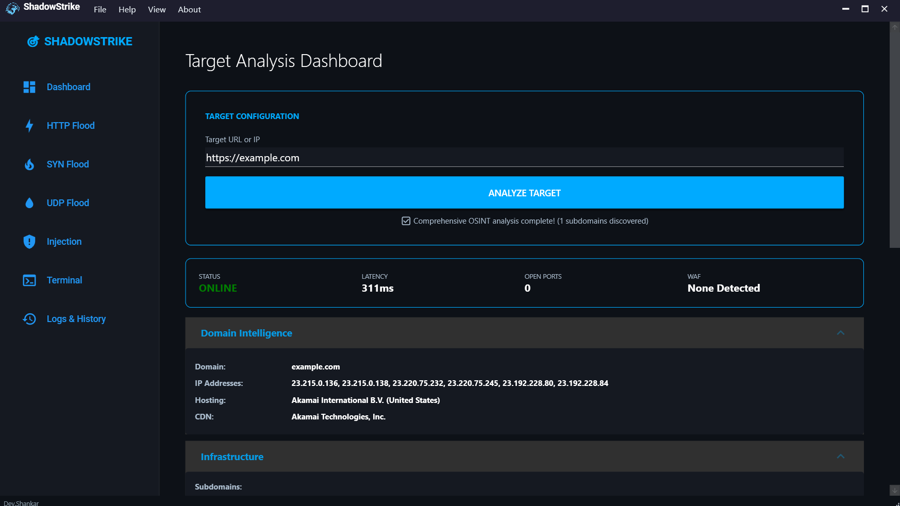
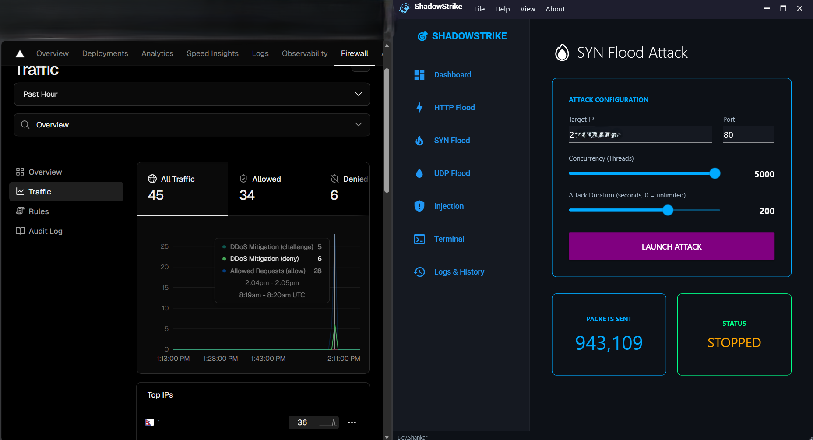
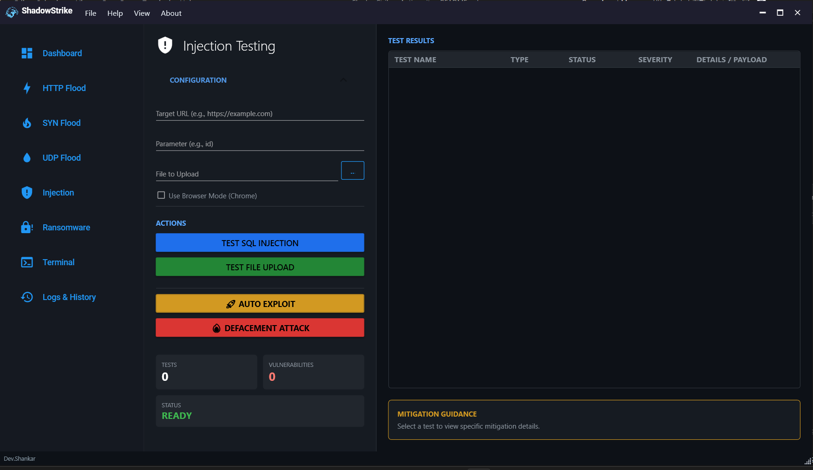
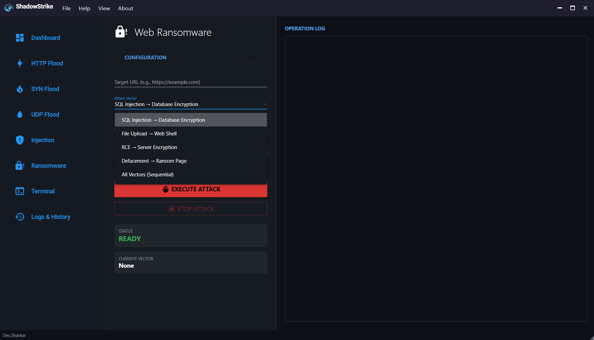
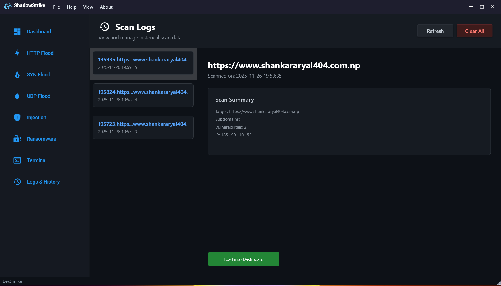

# ShadowStrike - Version 2.0

<div align="center">


**Advanced Security Testing & Penetration Testing Platform**

[](https://dotnet.microsoft.com/)
[](LICENSE)
[](https://www.microsoft.com/windows)
[](https://materialdesigninxaml.net/)
[](https://github.com/MrShankarAryal/ShadowStrike/releases)

*High-performance network security assessment tool built with .NET 8 & WPF*

</div>

---

## Table of Contents

- [Overview](#overview)
- [Features](#features)
- [Screenshots](#screenshots)
- [Installation](#installation)
- [Usage](#usage)
- [Modules](#modules)
- [Architecture](#architecture)
- [Legal Disclaimer](#legal-disclaimer)
- [Contributing](#contributing)
- [Author](#author)
- [License](#license)

---

## Overview

**ShadowStrike** is a comprehensive security testing platform designed for ethical hackers, penetration testers, and security researchers. Built from the ground up with .NET 8 and WPF, it provides a modern, high-performance alternative to traditional security tools.

### Why ShadowStrike?

- **High Performance**: Built with .NET 8 for maximum speed and efficiency
- **Modern UI**: Beautiful Material Design interface with dark theme
- **Comprehensive**: OSINT, DDoS testing, injection testing, and more
- **Intelligent**: Automated vulnerability detection and reporting
- **Persistent**: Automatic logging and historical scan management
- **Evasion**: Advanced techniques to bypass WAFs and security measures

---

## Features

### OSINT & Reconnaissance
- **Target Analysis**: Comprehensive information gathering
- **DNS Intelligence**: A/MX/NS records, subdomain enumeration
- **WHOIS Lookup**: Domain registration and ownership details
- **SSL/TLS Analysis**: Certificate validation and security assessment
- **Email Security**: SPF, DKIM, DMARC record verification
- **Technology Detection**: Server, CMS, framework identification
- **WAF Detection**: Identify security products (Cloudflare, AWS WAF, etc.)
- **Port Scanning**: Detect open ports and running services

### DDoS Attack Modules
- **HTTP Flood (Layer 7)**: Application-layer attacks with customizable threads
- **SYN Flood (Layer 4)**: TCP handshake exploitation
- **UDP Flood (Layer 4)**: Bandwidth exhaustion attacks
- **Real-time Monitoring**: Live attack statistics and performance metrics

### Injection Testing
- **SQL Injection**: Error-based and time-based blind SQLi detection
- **File Upload Testing**: Multiple bypass techniques (double extension, null byte, etc.)
- **Auto Exploit**: Automated vulnerability discovery and exploitation
- **Defacement Mode**: Database content modification capabilities
- **Browser Mode**: Stealth testing using real Chrome browser
- **Advanced SQLi**: Union-based, boolean-based, and stacked queries

### Logging & History
- **Automatic Logging**: Every scan automatically saved as JSON
- **Historical Reports**: View and reload past assessments
- **Load into Dashboard**: Restore previous scan states without re-scanning
- **Export Capabilities**: JSON format for integration with other tools

### Help & Documentation
- **Comprehensive Guide**: Detailed explanations for beginners
- **Module Documentation**: In-depth coverage of all features
- **Parameter Explanations**: Understand what each option does
- **Best Practices**: Security testing guidelines and tips

---

## Screenshots

### Dashboard - OSINT Intelligence

*Comprehensive target analysis with technology stack detection*

### DDoS Attack Modules

*HTTP, SYN, and UDP flood attacks with real-time monitoring*

### Injection Testing

*SQL injection and file upload vulnerability testing*

### Ransomware Testing

*Ransomware analysis and detection*

### Logs & History

*Persistent logging with historical scan management*

---

## Installation

### Supported Platforms

- **Windows 10/11 (64-bit & 32-bit)**
- *Note: Linux and macOS are currently NOT supported due to Windows-specific dependencies.*

### Option 1: Installer (Recommended)

Download the latest installer from the [Releases](https://github.com/MrShankarAryal/ShadowStrike/releases) page.

1. Download `ShadowStrike-Setup-v2.1.0.exe`
2. Run the installer
3. Follow the installation wizard
4. Launch from Start Menu or Desktop shortcut

**Features:**
- ✅ Automatic installation to Program Files
- ✅ Start Menu and Desktop shortcuts with icon
- ✅ Clean uninstall support
- ✅ No .NET installation required (bundled)

### Option 2: Portable Version

Download the portable version from the [Releases](https://github.com/MrShankarAryal/ShadowStrike/releases) page.

1. Download `ShadowStrike-v2.1.0-Portable.zip`
2. Extract to any folder
3. Run `ShadowStrike.UI.exe`

**Features:**
- ✅ No installation required
- ✅ Run from USB drive or any location
- ✅ Perfect for portable use

### Option 3: Build from Source

For developers who want to build from source:

```bash
# Clone the repository
git clone https://github.com/MrShankarAryal/ShadowStrike.git
cd ShadowStrike

# Restore dependencies
dotnet restore

# Build the solution
dotnet build --configuration Release

# Run the application
dotnet run --project ShadowStrike.UI/ShadowStrike.UI.csproj
```

**Prerequisites:**
- .NET 8 SDK
- Windows 10/11
- Administrator privileges (for raw socket operations)

---

## Usage

### Quick Start

1. **Launch ShadowStrike**
   ```bash
   dotnet run --project ShadowStrike.UI/ShadowStrike.UI.csproj
   ```

2. **Perform Reconnaissance**
   - Navigate to **Dashboard**
   - Enter target URL/IP (e.g., `http://example.com`)
   - Click **"Analyze Target"**
   - Review OSINT data, technology stack, and vulnerabilities

3. **Execute Security Tests**
   - Choose appropriate module (DDoS, Injection)
   - Configure parameters
   - Monitor real-time results

4. **Review History**
   - Go to **Logs & History**
   - View past scans
   - Load reports into Dashboard

### Command Line Options

```bash
# Run in release mode
dotnet run --project ShadowStrike.UI/ShadowStrike.UI.csproj --configuration Release

# Build without running
dotnet build --configuration Release

# Clean build artifacts
dotnet clean
```

---

## Modules

### 1. Dashboard (OSINT Engine)

**Purpose**: Gather comprehensive intelligence about the target

**Capabilities**:
- DNS record enumeration (A, MX, NS, TXT)
- WHOIS information retrieval
- SSL/TLS certificate analysis
- Email security verification (SPF, DKIM, DMARC)
- Technology stack fingerprinting
- WAF detection
- Port scanning (common ports: 21, 22, 80, 443, 3306, etc.)
- Vulnerability assessment

**Output**: Detailed report with all gathered intelligence

---

### 2. HTTP Flood

**Purpose**: Test web server resilience against application-layer attacks

**Parameters**:
- **Threads**: Number of concurrent connections (50-500+)
- **Timeout**: Response wait time in seconds (0.5-5s)

**How it works**: Floods the target with HTTP GET/POST requests to exhaust server resources (CPU, RAM, bandwidth)

**Best for**: Small to medium web servers, shared hosting

---

### 3. SYN Flood

**Purpose**: Test network infrastructure against TCP handshake exploitation

**Parameters**:
- **Packet Size**: Payload size in bytes (64-1024)

**How it works**: Sends SYN packets without completing the 3-way handshake, filling the connection table

**Best for**: Servers with limited connection tables, older network equipment

**Note**: Requires administrator privileges

---

### 4. UDP Flood

**Purpose**: Test bandwidth and processing capacity

**How it works**: Sends UDP packets to random ports, forcing ICMP "Destination Unreachable" responses

**Best for**: Game servers, VoIP services, DNS servers

---

### 5. Injection Testing

**SQL Injection**:
- Error-based detection
- Time-based blind SQLi
- Union-based queries
- Boolean-based blind SQLi
- Stacked queries

**File Upload Testing**:
- Double extension bypass (`shell.php.jpg`)
- Null byte injection (`shell.php%00.jpg`)
- Content-Type manipulation
- MIME type bypass

**Advanced Features**:
- **Auto Exploit**: Automated crawling and vulnerability discovery
- **Defacement**: Database content modification
- **Browser Mode**: Stealth testing with real Chrome browser

---

### 6. Logs & History

**Features**:
- Automatic JSON logging of all scans
- Historical scan viewer with Dark Dimmed theme
- Load previous reports without re-scanning
- Export capabilities
- Clear all logs option
- Improved UI with consistent styling

**Storage Location**: `Logs/` directory

---

## Architecture

### Project Structure

```
ShadowStrike/
├── ShadowStrike.Core/          # Core business logic
│   ├── OsintEngine.cs          # OSINT intelligence gathering
│   ├── DnsAnalyzer.cs          # DNS record analysis
│   ├── SslAnalyzer.cs          # SSL/TLS certificate validation
│   ├── TargetAnalyzer.cs       # Technology detection
│   ├── VulnerabilityHunter.cs  # Vulnerability assessment
│   ├── HttpFlooder.cs          # HTTP flood implementation
│   ├── SynFlooder.cs           # SYN flood implementation
│   ├── UdpFlooder.cs           # UDP flood implementation
│   ├── SqlInjector.cs          # SQL injection testing
│   ├── FileUploadTester.cs     # File upload vulnerability testing
│   ├── SiteCrawler.cs          # Web crawler for auto-exploit
│   └── HistoryManager.cs       # Logging and history management
│
├── ShadowStrike.UI/            # WPF user interface
│   ├── Views/                  # XAML views
│   │   ├── DashboardView.xaml  # OSINT dashboard
│   │   ├── HttpFloodView.xaml  # HTTP flood UI
│   │   ├── SynFloodView.xaml   # SYN flood UI
│   │   ├── UdpFloodView.xaml   # UDP flood UI
│   │   ├── InjectionView.xaml  # Injection testing UI
│   │   ├── LogsView.xaml       # History viewer
│   │   ├── TerminalView.xaml   # Terminal interface
│   │   └── HelpWindow.xaml     # Help documentation
│   ├── MainWindow.xaml         # Main application window
│   ├── AppState.cs             # Application state management
│   └── img/                    # Application resources
│
├── Logs/                       # Automatic scan logs (JSON)
├── README.md                   # This file
└── LICENSE                     # MIT License
```

### Technology Stack

- **Framework**: .NET 8.0
- **UI**: WPF (Windows Presentation Foundation)
- **Design**: Material Design In XAML Toolkit
- **Language**: C# 12
- **Networking**: System.Net, HttpClient
- **DNS**: DnsClient.NET
- **Browser Automation**: Selenium WebDriver (Chrome)

---

## Legal Disclaimer

**IMPORTANT**: This tool is designed for **authorized security testing only**.

### Legal Use Only

- ~ **Authorized Testing**: Only test systems you own or have explicit written permission to test
- ~ **Educational Purposes**: Learning about security vulnerabilities and defense mechanisms
- ~ **Penetration Testing**: Professional security assessments with proper authorization
- ~ **Bug Bounty Programs**: Participating in legitimate bug bounty programs

### Prohibited Use

- ~ **Unauthorized Access**: Testing systems without permission is illegal
- ~ **Malicious Intent**: Using this tool to harm or disrupt services
- ~ **Data Theft**: Extracting sensitive information without authorization
- ~ **Criminal Activity**: Any use that violates local, state, or federal laws

### Disclaimer

The author and contributors of ShadowStrike are **not responsible** for any misuse of this tool. By using this software, you agree to use it **ethically and legally**. Unauthorized use may result in:

- Criminal prosecution
- Civil lawsuits
- Financial penalties
- Imprisonment

**Always obtain proper authorization before conducting security assessments.**

---

##  Contributing

Contributions are welcome! Please follow these guidelines:

### How to Contribute

1. **Fork the repository**
2. **Create a feature branch** (`git checkout -b feature/AmazingFeature`)
3. **Commit your changes** (`git commit -m 'Add some AmazingFeature'`)
4. **Push to the branch** (`git push origin feature/AmazingFeature`)
5. **Open a Pull Request**

### Code Standards

- Follow C# coding conventions
- Add XML documentation comments
- Write unit tests for new features
- Ensure all tests pass before submitting PR
- Update README.md if adding new features

### Reporting Issues

- Use the [GitHub Issues](https://github.com/MrShankarAryal/ShadowStrike/issues) page
- Provide detailed description of the problem
- Include steps to reproduce
- Attach screenshots if applicable

---

##  Author

**Shankar Aryal**

- GitHub: [@MrShankarAryal](https://github.com/MrShankarAryal)
- Email: ShadowStrikeContact@shankararyal404.com.np
- Website: [shankararyal404.com.np](https://shankararyal404.com.np)

### Version History

- **Version 2.0** (2025) - Complete .NET 8 rewrite with WPF UI
- **Version 1.0** (2024) - Original Python implementation

---

## �️ Roadmap

- [ ] **Cross-Platform Support**: Linux and macOS support via CLI or Avalonia UI
- [ ] **Cloud Integration**: Remote scanning and reporting
- [ ] **Plugin System**: API for community-developed modules
- [ ] **AI Enhancement**: Advanced threat detection models

---

## � License

This project is licensed under the **MIT License** - see the [LICENSE](LICENSE) file for details.

```
MIT License

Copyright (c) 2025 Shankar Aryal

Permission is hereby granted, free of charge, to any person obtaining a copy
of this software and associated documentation files (the "Software"), to deal
in the Software without restriction, including without limitation the rights
to use, copy, modify, merge, publish, distribute, sublicense, and/or sell
copies of the Software, and to permit persons to whom the Software is
furnished to do so, subject to the following conditions:

The above copyright notice and this permission notice shall be included in all
copies or substantial portions of the Software.

THE SOFTWARE IS PROVIDED "AS IS", WITHOUT WARRANTY OF ANY KIND, EXPRESS OR
IMPLIED, INCLUDING BUT NOT LIMITED TO THE WARRANTIES OF MERCHANTABILITY,
FITNESS FOR A PARTICULAR PURPOSE AND NONINFRINGEMENT. IN NO EVENT SHALL THE
AUTHORS OR COPYRIGHT HOLDERS BE LIABLE FOR ANY CLAIM, DAMAGES OR OTHER
LIABILITY, WHETHER IN AN ACTION OF CONTRACT, TORT OR OTHERWISE, ARISING FROM,
OUT OF OR IN CONNECTION WITH THE SOFTWARE OR THE USE OR OTHER DEALINGS IN THE
SOFTWARE.
```

---

##  Acknowledgments

- [Material Design In XAML](https://github.com/MaterialDesignInXAML/MaterialDesignInXamlToolkit) - Beautiful UI components
- [DnsClient.NET](https://github.com/MichaCo/DnsClient.NET) - DNS resolution library
- Double extension bypass (`shell.php.jpg`)
- Null byte injection (`shell.php%00.jpg`)
- Content-Type manipulation
- MIME type bypass

**Advanced Features**:
- **Auto Exploit**: Automated crawling and vulnerability discovery
- **Defacement**: Database content modification
- **Browser Mode**: Stealth testing with real Chrome browser

---

### 6. Logs & History

**Features**:
- Automatic JSON logging of all scans
- Historical scan viewer with Dark Dimmed theme
- Load previous reports without re-scanning
- Export capabilities
- Clear all logs option
- Improved UI with consistent styling

**Storage Location**: `Logs/` directory

---

## Architecture

### Project Structure

```
ShadowStrike/
├── ShadowStrike.Core/          # Core business logic
│   ├── OsintEngine.cs          # OSINT intelligence gathering
│   ├── DnsAnalyzer.cs          # DNS record analysis
│   ├── SslAnalyzer.cs          # SSL/TLS certificate validation
│   ├── TargetAnalyzer.cs       # Technology detection
│   ├── VulnerabilityHunter.cs  # Vulnerability assessment
│   ├── HttpFlooder.cs          # HTTP flood implementation
│   ├── SynFlooder.cs           # SYN flood implementation
│   ├── UdpFlooder.cs           # UDP flood implementation
│   ├── SqlInjector.cs          # SQL injection testing
│   ├── FileUploadTester.cs     # File upload vulnerability testing
│   ├── SiteCrawler.cs          # Web crawler for auto-exploit
│   └── HistoryManager.cs       # Logging and history management
│
├── ShadowStrike.UI/            # WPF user interface
│   ├── Views/                  # XAML views
│   │   ├── DashboardView.xaml  # OSINT dashboard
│   │   ├── HttpFloodView.xaml  # HTTP flood UI
│   │   ├── SynFloodView.xaml   # SYN flood UI
│   │   ├── UdpFloodView.xaml   # UDP flood UI
│   │   ├── InjectionView.xaml  # Injection testing UI
│   │   ├── LogsView.xaml       # History viewer
│   │   ├── TerminalView.xaml   # Terminal interface
│   │   └── HelpWindow.xaml     # Help documentation
│   ├── MainWindow.xaml         # Main application window
│   ├── AppState.cs             # Application state management
│   └── img/                    # Application resources
│
├── Logs/                       # Automatic scan logs (JSON)
├── README.md                   # This file
└── LICENSE                     # MIT License
```

### Technology Stack

- **Framework**: .NET 8.0
- **UI**: WPF (Windows Presentation Foundation)
- **Design**: Material Design In XAML Toolkit
- **Language**: C# 12
- **Networking**: System.Net, HttpClient
- **DNS**: DnsClient.NET
- **Browser Automation**: Selenium WebDriver (Chrome)

---

## Legal Disclaimer

**IMPORTANT**: This tool is designed for **authorized security testing only**.

### Legal Use Only

- Authorized Testing: Only test systems you own or have explicit written permission to test
- Educational Purposes: Learning about security vulnerabilities and defense mechanisms
- Penetration Testing: Professional security assessments with proper authorization
- Bug Bounty Programs: Participating in legitimate bug bounty programs

### Prohibited Use

- Unauthorized Access: Testing systems without permission is illegal
- Malicious Intent: Using this tool to harm or disrupt services
- Data Theft: Extracting sensitive information without authorization
- Criminal Activity: Any use that violates local, state, or federal laws

### Disclaimer

The author and contributors of ShadowStrike are **not responsible** for any misuse of this tool. By using this software, you agree to use it **ethically and legally**. Unauthorized use may result in:

- Criminal prosecution
- Civil lawsuits
- Financial penalties
- Imprisonment

**Always obtain proper authorization before conducting security assessments.**

---

## Contributing

Contributions are welcome! Please follow these guidelines:

### How to Contribute

1. **Fork the repository**
2. **Create a feature branch** (`git checkout -b feature/AmazingFeature`)
3. **Commit your changes** (`git commit -m 'Add some AmazingFeature'`)
4. **Push to the branch** (`git push origin feature/AmazingFeature`)
5. **Open a Pull Request**

### Code Standards

- Follow C# coding conventions
- Add XML documentation comments
- Write unit tests for new features
- Ensure all tests pass before submitting PR
- Update README.md if adding new features

### Reporting Issues

- Use the [GitHub Issues](https://github.com/MrShankarAryal/ShadowStrike/issues) page
- Provide detailed description of the problem
- Include steps to reproduce
- Attach screenshots if applicable

---

## Author

**Shankar Aryal**

- GitHub: [@MrShankarAryal](https://github.com/MrShankarAryal)
- Email: ShadowStrikeContact@shankararyal404.com.np
- Website: [shankararyal404.com.np](https://shankararyal404.com.np)

### Version History

- **Version 2.0** (2025) - Complete .NET 8 rewrite with WPF UI
- **Version 1.0** (2024) - Original Python implementation

---

## Roadmap

- [ ] **Cross-Platform Support**: Linux and macOS support via CLI or Avalonia UI
- [ ] **Cloud Integration**: Remote scanning and reporting
- [ ] **Plugin System**: API for community-developed modules
- [ ] **Auto Enhancement**: Advanced threat detection models

---

## License

This project is licensed under the **MIT License** - see the [LICENSE](LICENSE) file for details.

```
MIT License

Copyright (c) 2025 Shankar Aryal

Permission is hereby granted, free of charge, to any person obtaining a copy
of this software and associated documentation files (the "Software"), to deal
in the Software without restriction, including without limitation the rights
to use, copy, modify, merge, publish, distribute, sublicense, and/or sell
copies of the Software, and to permit persons to whom the Software is
furnished to do so, subject to the following conditions:

The above copyright notice and this permission notice shall be included in all
copies or substantial portions of the Software.

THE SOFTWARE IS PROVIDED "AS IS", WITHOUT WARRANTY OF ANY KIND, EXPRESS OR
IMPLIED, INCLUDING BUT NOT LIMITED TO THE WARRANTIES OF MERCHANTABILITY,
FITNESS FOR A PARTICULAR PURPOSE AND NONINFRINGEMENT. IN NO EVENT SHALL THE
AUTHORS OR COPYRIGHT HOLDERS BE LIABLE FOR ANY CLAIM, DAMAGES OR OTHER
LIABILITY, WHETHER IN AN ACTION OF CONTRACT, TORT OR OTHERWISE, ARISING FROM,
OUT OF OR IN CONNECTION WITH THE SOFTWARE OR THE USE OR OTHER DEALINGS IN THE
SOFTWARE.
```

---

## Acknowledgments

- [Material Design In XAML](https://github.com/MaterialDesignInXAML/MaterialDesignInXamlToolkit) - Beautiful UI components
- [DnsClient.NET](https://github.com/MichaCo/DnsClient.NET) - DNS resolution library
- [Selenium WebDriver](https://www.selenium.dev/) - Browser automation
- [.NET Community](https://dotnet.microsoft.com/platform/community) - Amazing framework and support

---

## Support

For support, email ShadowStrikeContact@shankararyal404.com.np or open an issue on GitHub.

---

<div align="center">

**Star this repository if you find it helpful!**

Made by [Shankar Aryal](https://github.com/MrShankarAryal)

</div>
